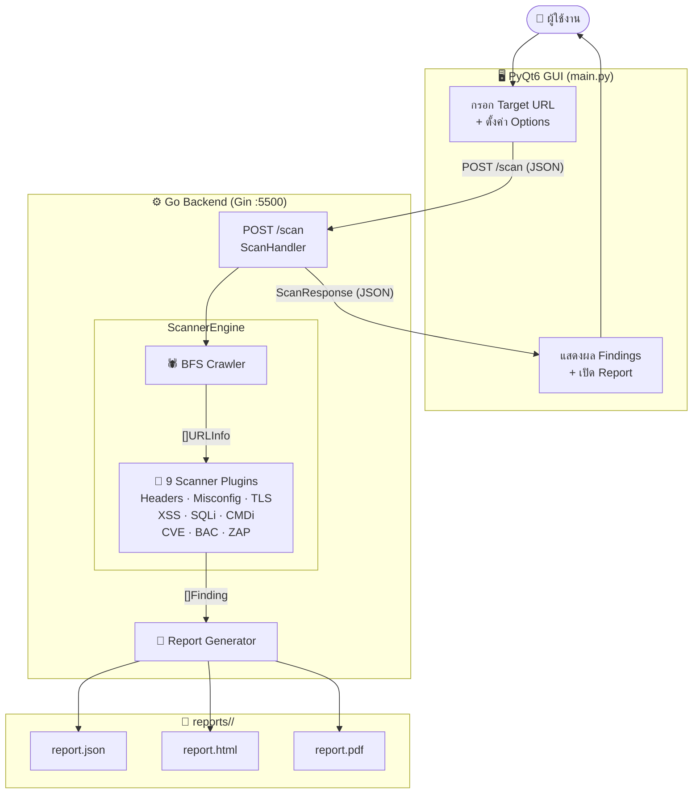

# Project Horizon — Vulnerability Assessment Scanner

ระบบประเมินช่องโหว่เว็บแอปพลิเคชันอัตโนมัติ ครอบคลุม **OWASP Top 10:2025**  
พัฒนาเป็นส่วนหนึ่งของวิทยานิพนธ์ระดับปริญญาตรี สาขาความมั่นคงปลอดภัยไซเบอร์  
สนับสนุนการปฏิบัติตาม **ประมวลแนวปฏิบัติการรักษาความมั่นคงปลอดภัยไซเบอร์ กสทช. 2565**

---

## ภาพรวม



---

## คุณสมบัติหลัก

| ฟีเจอร์ | รายละเอียด |
|---------|-----------|
| 🕷 **BFS Crawler** | ค้นหา URL อัตโนมัติ รองรับ max pages / depth / delay |
| 🔌 **9 Scanner Plugins** | ครอบคลุม OWASP Top 10:2025 จำนวน 7/10 หมวด |
| 🔑 **Form Authentication** | Auto-detect login form + CSRF token, session cookies |
| 💀 **Brute Force** | ทดสอบ username × password พร้อม 3-signal detection |
| 📄 **3 Report Formats** | JSON · HTML (interactive) · PDF พร้อม Executive Summary |
| 🔴 **Real-time Progress** | Progress bar + log stream ผ่าน polling API |
| ⏹ **Cancel Scan** | หยุดการสแกนกลางคันได้ทันที |
| 🕷 **OWASP ZAP** | เชื่อมต่อ ZAP API สำหรับ Active Scan ขั้นสูง |

---

## Scanner Modules (9 Plugins)

| Plugin | ตรวจสอบ | OWASP | รายละเอียด |
|--------|---------|-------|-----------|
| `HeaderScanner` | Security Headers | A06 | 9 checks — CSP, HSTS, X-Frame-Options, X-XSS-Protection, Referrer-Policy, Permissions-Policy, X-Content-Type-Options |
| `MisconfigScanner` | Server Misconfiguration | A02 | Debug endpoints, server version disclosure, error page leakage |
| `TLSScanner` | TLS/Certificate | A04 | Weak TLS version, expired/self-signed cert, cipher detection |
| `XSSScanner` | Cross-Site Scripting | A05 | Nonce-based reflection probing, 8 payload templates |
| `SQLiScanner` | SQL Injection | A05 | 3-phase: Error-based → Boolean-blind → Time-based (SLEEP/pg_sleep/WAITFOR) |
| `CMDiScanner` | OS Command Injection | A05 | Time-based (sleep/ping, ≥baseline+4s) + Output-based (uid=, /etc/passwd) |
| `CVEScanner` | Known CVEs | A03 | Banner matching กับ 25+ CVE signatures |
| `BACScanner` | Broken Access Control | A01 | CSRF, Sensitive paths, Open Redirect, Directory Listing, Cookie SameSite, Sensitive Comments |
| `ZAPScanner` | Full Active Scan | A01–A07 | OWASP ZAP REST API integration + AJAX Spider |

---

## ความต้องการระบบ

| ซอฟต์แวร์ | เวอร์ชันขั้นต่ำ |
|-----------|----------------|
| Python | 3.9+ |
| Go | 1.21+ |
| OWASP ZAP *(optional)* | 2.14+ |

รองรับ: **Windows · macOS · Linux**

---

## การติดตั้ง

### Windows
```bat
install.bat
```

### macOS / Linux
```bash
sh install.sh
# หรือ
python3 install.py
```

ตัว installer จะทำสิ่งเหล่านี้อัตโนมัติ:
1. ตรวจสอบ Python ≥ 3.9 (เสนอ download ถ้าเวอร์ชันเก่า)
2. ตรวจสอบ Go ≥ 1.21 (เสนอ download ถ้ายังไม่มี)
3. สร้าง Python virtual environment (`venv/`)
4. ติดตั้ง dependencies จาก `requirements.txt`

---

## การใช้งาน

### เริ่มโปรแกรม

```bash
# Windows / macOS / Linux
python start.py
```

`start.py` จะ build Go backend → เริ่ม server → รอ health check → เปิด GUI อัตโนมัติ

---

### ขั้นตอนการสแกน

1. กรอก **Target URL** (เช่น `https://example.com`)
2. ตั้งค่าพารามิเตอร์:
   - **Max Pages** — จำนวน URL สูงสุดที่ crawl (1–200, default 30)
   - **Max Depth** — ความลึกของ crawl (1–4, default 2)
   - **Delay** — หน่วงระหว่าง request (0–500 ms)
3. เลือก **Scan Mode**:
   - **Normal** — จำกัด pages/depth, หยุดเมื่อพบช่องโหว่แรก (เร็วที่สุด)
   - **Timed** — ไม่จำกัด pages/depth, มี time limit (default 5 นาที)
   - **Full Scan** — สแกนทุก URL, ทุก phase, ทุก payload
4. เลือก **Modules** ที่ต้องการ
5. กด **Start Scan**

---

### Scan Modes

```
Normal Mode  →  max 30 pages, depth 2  →  หยุดเมื่อพบช่องโหว่แรกต่อ parameter
Timed Mode   →  ไม่จำกัด pages/depth  →  หยุดเมื่อครบ time limit
Full Scan    →  ไม่จำกัดทุกอย่าง     →  รัน XSS/SQLi/CMDi ทุก phase ทุก payload
```

---

### Authentication

เปิด **Authentication** เพื่อให้ scanner login ก่อนสแกน:

```
Login URL       : https://example.com/login
Username        : user@example.com
Password        : password123
Username Field  : email        (ปล่อยว่างให้ auto-detect)
Password Field  : password     (ปล่อยว่างให้ auto-detect)
```

> ระบบจะ auto-detect HTML form fields และ CSRF token อัตโนมัติ  
> Session cookies จะถูกส่งต่อให้ทุก request หลัง login

---

### Brute Force

เปิด **Brute Force** เพื่อทดสอบ credential list:

```
Login URL  : https://example.com/login
Usernames  : พิมพ์ทีละบรรทัด หรือกด Upload .txt
Passwords  : พิมพ์ทีละบรรทัด หรือกด Upload .txt
Delay      : 300 ms (min 100 ms)
Max Attempts : 100 (สูงสุด 500)
```

> ⚠️ ใช้งานกับระบบที่ได้รับอนุญาตเท่านั้น  
> หากพบ credential สำเร็จ จะรายงานเป็น Critical — CWE-521/307, A07:2025

---

## Report Format

รายงานทุกรูปแบบประกอบด้วย:

```
Executive Summary   ← ภาพรวมผลการสแกน (auto-generated)
Methodology         ← อธิบาย 4-phase scanning methodology
Summary Table       ← ตารางรวม findings ทั้งหมด
Detailed Findings   ← รายละเอียดทุก finding พร้อม Evidence, Request, Response
Risk Rating (CVSS)  ← CVSS score + OWASP category + CWE IDs
Conclusions         ← สรุปความเสี่ยงและคำแนะนำ (auto-generated)
```

| Format | ไฟล์ | รายละเอียด |
|--------|------|-----------|
| JSON | `report.json` | Machine-readable, ครบทุก field รวม HTTP dump |
| HTML | `report.html` | Interactive dark-theme report, filter by severity |
| PDF | `report.pdf` | Professional document พร้อมส่งองค์กร |

รายงานจะถูกบันทึกที่ `reports/<SCAN_ID>/`

---

## API Endpoints

Backend รันที่ `http://127.0.0.1:5500`

| Method | Endpoint | คำอธิบาย |
|--------|----------|----------|
| `POST` | `/scan` | เริ่มสแกน — รับ JSON body (ScanRequest) |
| `GET` | `/progress` | ดู progress ปัจจุบัน (phase, done/total, %) |
| `GET` | `/logs?after=N` | ดู backend log lines ตั้งแต่ index N |
| `POST` | `/cancel` | ยกเลิกการสแกนที่กำลังทำงาน |
| `GET` | `/health` | ตรวจสอบว่า backend พร้อมใช้งาน |

### ตัวอย่าง ScanRequest

```json
{
  "target": "https://example.com",
  "max_pages": 30,
  "max_depth": 2,
  "request_delay_ms": 100,
  "options": {
    "headers": true,
    "misconfig": true,
    "tls": true,
    "xss": true,
    "sqli": true,
    "cmdi": false,
    "cve": true,
    "bac": true,
    "zap": false
  },
  "report_formats": ["json", "html", "pdf"]
}
```

---

## OWASP Top 10:2025 Coverage

| หมวด | ชื่อ | Plugin | สถานะ |
|------|------|--------|-------|
| A01 | Broken Access Control | BACScanner, ZAPScanner | ✅ |
| A02 | Security Misconfiguration | MisconfigScanner | ✅ |
| A03 | Software Supply Chain Failures | CVEScanner | ✅ |
| A04 | Cryptographic Failures | TLSScanner | ✅ |
| A05 | Injection | XSSScanner, SQLiScanner, CMDiScanner | ✅ |
| A06 | Insecure Design | HeaderScanner | ✅ |
| A07 | Authentication Failures | BruteForce module | ✅ |
| A08 | Software/Data Integrity Failures | — | ⚪ ZAP indirect |
| A09 | Logging and Alerting Failures | — | ⚪ ZAP indirect |
| A10 | Mishandling of Exceptional Conditions | — | ⚪ ZAP indirect |

**ครอบคลุม 7/10 หมวด (70%)** โดยตรง + A08–A10 ผ่าน ZAP Integration

---

## โครงสร้างโปรเจ็ค

```
Project_Horizon/
├── Backend_Go/
│   ├── cmd/scanner/main.go          ← HTTP server entry point (port 5500)
│   ├── internal/
│   │   ├── api/scan_handler.go      ← POST /scan request handler
│   │   ├── engine/scanner_engine.go ← Orchestrator (crawl → scan → report)
│   │   ├── crawler/crawler.go       ← BFS web crawler
│   │   ├── plugin/
│   │   │   ├── headers_scanner.go   ← 9 security header checks
│   │   │   ├── misconfig_scanner.go ← Server misconfiguration
│   │   │   ├── tls_scanner.go       ← TLS/certificate analysis
│   │   │   ├── xss_scanner.go       ← XSS (nonce-based reflection)
│   │   │   ├── sqli_scanner.go      ← SQL Injection (3-phase)
│   │   │   ├── cmdi_scanner.go      ← OS Command Injection
│   │   │   ├── cve_scanner.go       ← CVE banner matching
│   │   │   ├── bac_scanner.go       ← Broken Access Control (6 checks)
│   │   │   └── zap_scanner.go       ← OWASP ZAP integration
│   │   ├── model/model.go           ← Shared data structures
│   │   ├── report/
│   │   │   ├── report_service.go    ← Report orchestrator
│   │   │   ├── report_html.go       ← HTML report template
│   │   │   └── report_pdf.go        ← PDF report (fpdf)
│   │   ├── standards/owasp2025.go   ← OWASP Top 10:2025 constants
│   │   └── httpclient/client.go     ← Shared HTTP client
│   └── go.mod
├── GUI/
│   ├── main.py                      ← PyQt6 main window
│   └── api_client.py                ← HTTP client สำหรับ backend API
├── presentation/
│   └── index.html                   ← Reveal.js presentation (18 slides)
├── reports/                         ← รายงานที่สร้างขึ้น (auto-generated)
├── install.py                       ← Cross-platform installer
├── install.bat                      ← Windows install shortcut
├── install.sh                       ← macOS/Linux install shortcut
├── start.py                         ← Cross-platform launcher
├── requirements.txt                 ← Python dependencies
└── README.md
```

---

## Dependencies

### Go (Backend)
| Package | หน้าที่ |
|---------|---------|
| `gin-gonic/gin` | HTTP web framework |
| `gin-contrib/cors` | CORS middleware |
| `go-pdf/fpdf` | PDF generation |
| `golang.org/x/net` | HTML parser + HTTP/2/3 |
| `golang.org/x/crypto` | TLS helpers |

### Python (GUI)
| Package | หน้าที่ |
|---------|---------|
| `PyQt6` | Desktop GUI framework |
| `requests` | HTTP client |
| `psutil` | Process management |
| `beautifulsoup4` | HTML parsing |

---

## ข้อควรระวัง

> **⚠️ ใช้งานเฉพาะระบบที่ได้รับอนุญาตเท่านั้น**  
> การใช้เครื่องมือนี้กับระบบที่ไม่ได้รับอนุญาตอาจเป็นการกระทำที่ผิดกฎหมาย  
> ผู้พัฒนาไม่รับผิดชอบต่อความเสียหายที่เกิดจากการใช้งานในทางที่ผิด

**CMDi Scanner** (`cmdi_scanner.go`) ส่ง OS command payloads จริงไปยัง target  
Payload ถูกเลือกให้เป็น `sleep`/`ping` เพื่อตรวจจับด้วย timing โดยไม่สร้างไฟล์หรือ outbound connection ออกนอก target

---

## กรอบกฎหมายที่เกี่ยวข้อง

โปรเจ็คนี้สนับสนุนการปฏิบัติตาม **ประมวลแนวปฏิบัติการรักษาความมั่นคงปลอดภัยไซเบอร์**  
ของ **กสทช. (ประกาศ 7 ธันวาคม 2565)** หมวด 1.3 — การประเมินช่องโหว่

| หมวด กสทช. | Function | การรองรับ |
|-----------|----------|-----------|
| 1.3 Identify | ค้นหาช่องโหว่ในระบบ | ✅ Crawler + 9 Plugins |
| 1.3 Protect | ตรวจสอบ security headers/config | ✅ HeaderScanner + MisconfigScanner |
| 1.3 Detect | ตรวจจับ XSS/SQLi/CMDi/BAC | ✅ ทุก Injection plugin |
| 1.3 Respond | รายงานพร้อม Recommendation | ✅ HTML/PDF/JSON reports |

---

## ผู้พัฒนา

**ภูมินทร์ ทองลา**  
วิทยานิพนธ์ระดับปริญญาตรี — สาขาความมั่นคงปลอดภัยไซเบอร์